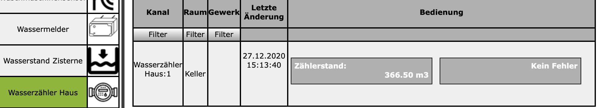

# HB-UNI-Sen-PC-WM
#### Homematic integrierter Wasserzähler mit optischer Impulserfassung

Idee basiert auf dem Impulsgeber für den Wasserzähler von [stall.biz](https://www.stall.biz/project/impulsgeber-fuer-den-wasserzaehler-selbst-gebaut).

### //TODO: Documentation

